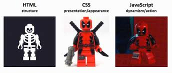

 

 

### Date: 6/04/2020
#### By: Alfonso D Rojas Hernandez 
#### | [GitHub](https://github.com/acostade29) | [LinkedIn](https://www.linkedin.com/in/alfonso-d-rojas-hernandez-2253a0105/)| 
***

##### The project was deployed on GitHub Pages and can be viewed via Heroku [here](https://guizmo-project.herokuapp.com/).
***

# User Experience#1:
## User Persona :
### Nelson, as a small business owner of a dog walking company is trying to find an app for their employees to be able to track the amount of dogs they need to walk.

# User Experience#1:
## User Persona :
### Mariela, one of Nelson's employees is new in the job and she is not sure where are the location and the dogs she needs to walk. this app will allow her track daily the amount of dogs she needs to wall and provide any feedback to review. 

## Motivation:  
### One of my previous jobs in Boston to help my friend Nelson starting his small company  as a dog Walker. We worked together and a small an personal app gets really handy for the person that works in this field. 

### ***Description***
|Gizmo Dog Walking Services  |
|---|
| User(dog walker) will be able to interact with and app able to check a list of dogs to walk|
| The user will be able to interact with the app and add, check, review and coment to all the dogs that has to be walk. 
| The user will be able to have acces to the main website as well |
| Features to use: |
| Create dog, add detail information.|
| Delete and check list. |
| Edit information|
| Add Comments|

***

### ***Getting Started***
|Screenshot|
|Main website|
</image>

|Google Authorization|

|Navegation bar|
|Gizmo Dog Walking Services :User will have access to the link of the company side|

<ig src="public/images/Screen Shot 2020-06-05 at 3.14.58 PM.png">

|All Dogs: This option will provide a detail list of all dogs, and will have access to more information.|

|My Dogs : this option will provide the user the option to create a dog info card and delete any card already once done.|
|Log Out: User will be able to log out their page and the information will be storage and save via Mongo DB|

   

### ***Technologies Used***

- For brand logo:
- canva.com
- css materialize:
- company Website: wix.com
- 

# Trelloboard and structure of the website [here](https://trello.com/b/Ly4uhb83/dog-walking).

## Future Updates 
- develop and add an API for miles tracker and map.
-  Create a better display for the board. animation background. 
-  Create a message interface between users.  

## Thank you 
- Thank you to all my classmates and instructors of this course. Everybody help me to achieve and make this app to work and function properly.
Thank you!

