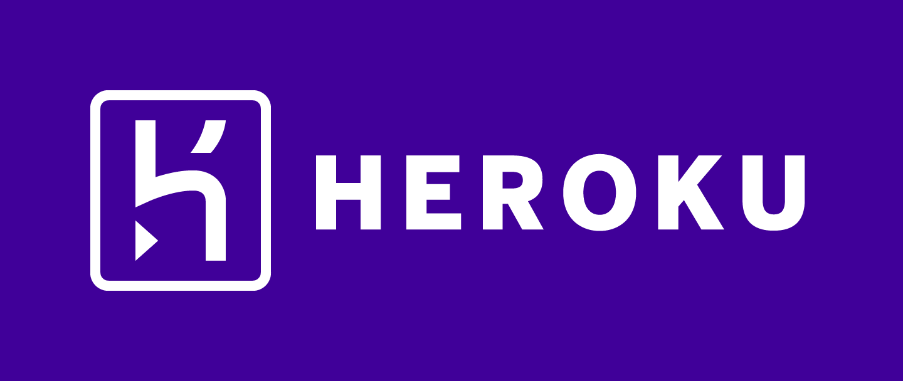

### Date: 6/04/2020
#### By: Alfonso D Rojas Hernandez 
#### | [GitHub](https://github.com/acostade29) | [LinkedIn](https://www.linkedin.com/in/alfonso-d-rojas-hernandez-2253a0105/)| 
***

##### The project was deployed on GitHub Pages and can be viewed via Heroku [here](https://guizmo-project.herokuapp.com/).
***

### ***Description***
|Gizmo Dog Walking Services  |
|---|
| User(dog walker) interactivity with and app able to check a list of dogs to walk|
| The user will be able to interact with the app and add, check, review and coment to all the dogs that has to be walk. 
| The user will be able to have acces to the main website as well |
| Features to use: |
| Create dog, add detail information.|
| Delete and check list. |
| Edit information|
| Add Comments|

***

### ***Getting Started***
|Screenshot|
|Main website|
</image>

|Google Authorization|
</image>

|Navegation bar|
|Gizmo Dog Walking Services :User will have access to the link of the company side|

<ig src="public/images/Screen Shot 2020-06-05 at 3.14.58 PM.png">

|All Dogs: This option will provide a detail list of all dogs, and will have access to more information.|

|My Dogs : this option will provide the user the option to create a dog info card and delete any card already once done.|
|Log Out: User will be able to log out their page and the information will be storage and save via Mongo DB|

   

### ***Technologies Used***

- For brand logo:
- canva.com
- css animation:
- https://animate.style/

# Simon-says- initiation of the project (Drawings)

#Structure of the Game 
##HTML 

##css

## JS initial tought process of game 

| Student will have to create in JS: |
|---|
| Step 1 :  put 8 color elements on the screen|
| step 2:  add event listeners to each |
| step 4:  play the first one or two colors in sequence (store in an array) |
| step 5:  get player entry (store in array)|
| step 6:  if solution array === player array, send congrats message and play element 3 of solution array|
| loop through steps 5/6 until winner or loser. | 

# Diagram of the code 

<a href="https://app.diagrams.net/#G1BhJGg4Prv4K_bbhyqU1NnH0b8bpa4VB2">  Initial Diagram structure of the game</a>

## Future Updates 
-  Improve the audio time and syncronization.
-  Create a better display for the board. animation background. 
-  Create more levels of dificulties including a rotatory display for the color buttons.  

## Reference 
- for logic understanding:
-  https://www.youtube.com/watch?v=W0MxUHlZo6U
- design reference:
-  https://www.youtube.com/watch?v=9MTR3V2XpRI
- webpage to be use as a main resource:
-  https://www.youtube.com/watch?v=n_ec3eowFLQ
- shapes css:
-  https://css-tricks.com/quick-css-trick-how-to-center-an-object-exactly-in-the-center/
- definitions:
-  https://p5js.org/
- how to use the promise function for flash the elements.:
-  https://editor.p5js.org/talkscheap/sketches/SJR8rSXlm 
-  https://developer.mozilla.org/en-US/docs/Web/JavaScript/Reference/Global_Objects/Promise 
-  https://www.youtube.com/watch?v=vn3tm0quoqE  
-  /https://www.youtube.com/watch?v=PoRJizFvM7s

